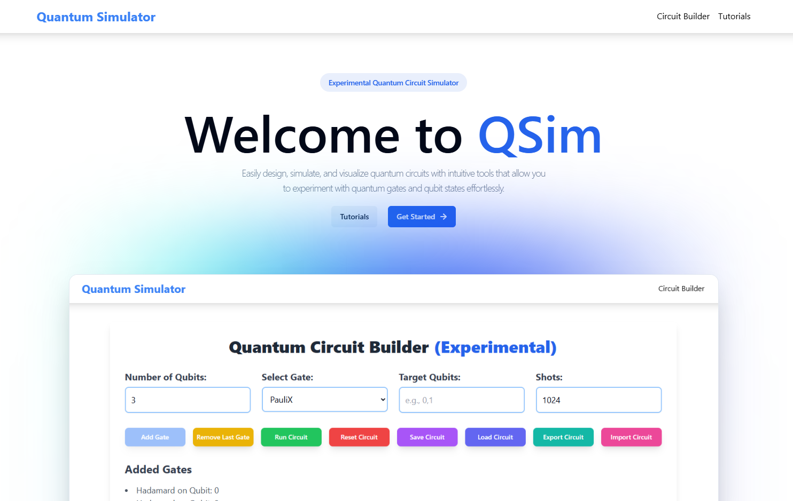

<h1 align="center">
QSim - Quantum Simulator
</h1>

<div align="center">

[](https://vite.dev/)
[](https://quantumsimulator.in/)
[](./LICENSE)
[](https://doi.org/10.5281/zenodo.17154174)

</div>



## Description

QSim is a web application to design, simulate, and visualize quantum circuits. Build circuits with common quantum gates, run simulations, inspect probabilities/counts, and see single-qubit states on Bloch spheres. It’s aimed at learners and enthusiasts for interactive experimentation.

## Features

- Circuit Builder UI with gate palette
  - Supported gates: Hadamard, PauliX, PauliY, PauliZ, RX, RY, RZ, CNOT, Swap, Toffoli, ControlledPhaseShift, Oracle, Diffusion
  - Visual circuit grid with per-qubit timeline, pagination, status bar, and accessible controls
  - Robust gate validation with clear error messages (arity, ranges, distinct multi‑qubit targets, conditional overlap checks)
  - Conditional gates (measure a qubit and apply only if outcome matches)
- Simulation
  - Probabilities and measurement counts via configurable shots
  - Per-qubit Bloch sphere parameters (computed from reduced single‑qubit expectations)
  - Sparse-state engine with defensive arity assertions and range checks
  - Optional per‑step normalization for robustness (configurable)
- Persistence and portability
  - Save/Load from browser storage
  - Import/Export circuits as JSON
  - Export circuit diagram as PNG
  - Export amplitudes as CSV
  - Shareable URL generation

## Getting Started

### Prerequisites

- Node.js 18 or higher
- npm (or yarn/pnpm)

### Installation

1. Clone the repository:

   ```bash
   git clone https://github.com/neuralsorcerer/qsim.git
   ```

2. Navigate to the project directory:

   ```bash
   cd qsim
   ```

3. Install dependencies:

   ```bash
   npm install
   ```

### Running the Application (Development)

1. Start the development server:

   ```bash
   npm run dev
   ```

2. Open your browser and navigate to: [http://localhost:5173](http://localhost:5173)

### Linting

```bash
npm run lint
```

### Building for Production

```bash
npm run build
```

- The production build will be output to the `dist/` directory.

### Preview the Production Build

```bash
npm run preview
```

This serves the contents of `dist/` locally for verification.

## Performance and limits

- Simulation memory/time grows as O(2^n). Very large n or deep circuits can hang a tab.
- Before running very large configurations, the app asks for confirmation (state size ≥ 2^18 or depth > 128).
- Wide global operators (Oracle/Diffusion) impact performance more than local 1–2 qubit gates.

## Environment Variables

- Optional:
  - `VITE_DEBUG`: set to `true` to enable additional debug logging in the app.
  - `VITE_NORMALIZE_EACH_STEP`: set to `false` to skip normalization after each gate for performance. Defaults to `true` for robustness. Measurements always renormalize.

Create a `.env` or `.env.local` file at the project root, for example:

```bash
VITE_DEBUG=true
VITE_NORMALIZE_EACH_STEP=true
```

## Notes on correctness and safety

- Defensive arity assertions: a k‑qubit gate must target exactly k qubits (derived from matrix size 2^k).
- Multi‑qubit gates require distinct target qubits; conditional qubit cannot overlap targets.
- Input ranges are validated (qubit indices and initial basis state).

## License

This project is licensed under the Apache License - see the [LICENSE](LICENSE) file for details.
