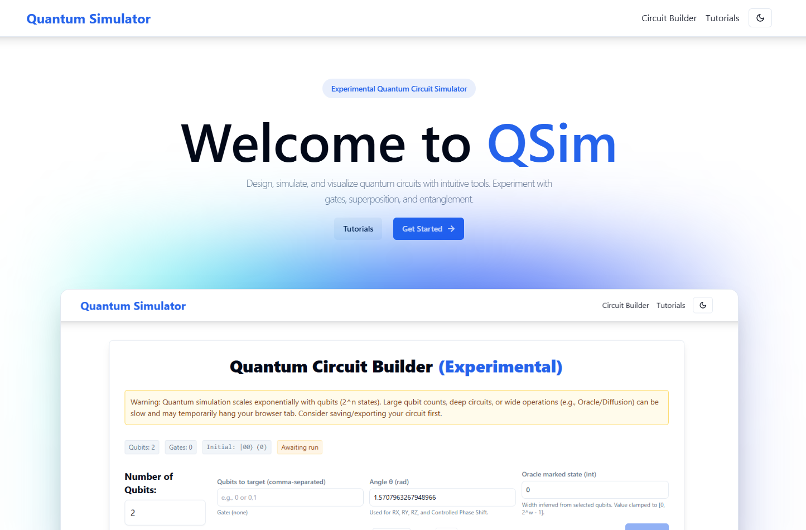

# QSim - Quantum Simulator



## Description

QSim is a web application to design, simulate, and visualize quantum circuits. Build circuits with common quantum gates, run simulations, inspect probabilities/counts, and see single-qubit states on Bloch spheres. It’s aimed at learners and enthusiasts for interactive experimentation.

## Features

- Circuit Builder UI with gate palette
  - Supported gates: Hadamard, PauliX, PauliY, PauliZ, RX, RY, RZ, CNOT, Swap, Toffoli, ControlledPhaseShift, Oracle, Diffusion
  - Visual circuit grid with per-qubit timeline
- Simulation
  - Probabilities and measurement counts via configurable shots
  - Per-qubit Bloch sphere parameters
- Persistence and portability
  - Save/Load from browser storage
  - Import/Export circuits as JSON
- SPA routing with a wildcard fallback
- Modern, responsive UI

## Getting Started

### Prerequisites

- Node.js 18 or higher
- npm (or yarn/pnpm)

### Installation

1. Clone the repository:

   ```bash
   git clone https://github.com/neuralsorcerer/qsim.git
   ```

2. Navigate to the project directory:

   ```bash
   cd qsim
   ```

3. Install dependencies:

   ```bash
   npm install
   ```

### Running the Application (Development)

1. Start the development server:

   ```bash
   npm run dev
   ```

2. Open your browser and navigate to: [http://localhost:5173](http://localhost:5173)

### Linting

```bash
npm run lint
```

### Building for Production

```bash
npm run build
```

- The production build will be output to the `dist/` directory.

### Preview the Production Build

```bash
npm run preview
```

This serves the contents of `dist/` locally for verification.

## Environment Variables

- Optional:
  - `VITE_DEBUG`: set to `true` to enable additional debug logging in the app.

Create a `.env` or `.env.local` file at the project root, for example:

```bash
VITE_DEBUG=true
```
